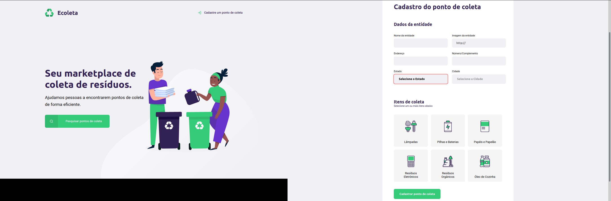

# Ecoleta
Projeto desenvolvido durante a Next Level Week, ministrada pela Rockeseat

## Ecoleta:
This project was developed during the Next Level Week, organized by [Rocketseat](https://rocketseat.com.br/):rocket:

### Objective:
The main objective of this project was create a **responsive marketplace**, working with **accessibility**.
 

### Finding:
The project was developed using good programming practices following the Model view controller (MVC) standards. :computer:

#### Utilized technologies:

- HTML5
  - CSS
  
- Javascript
  - Typescript
  - NodeJs
  
- SQL

